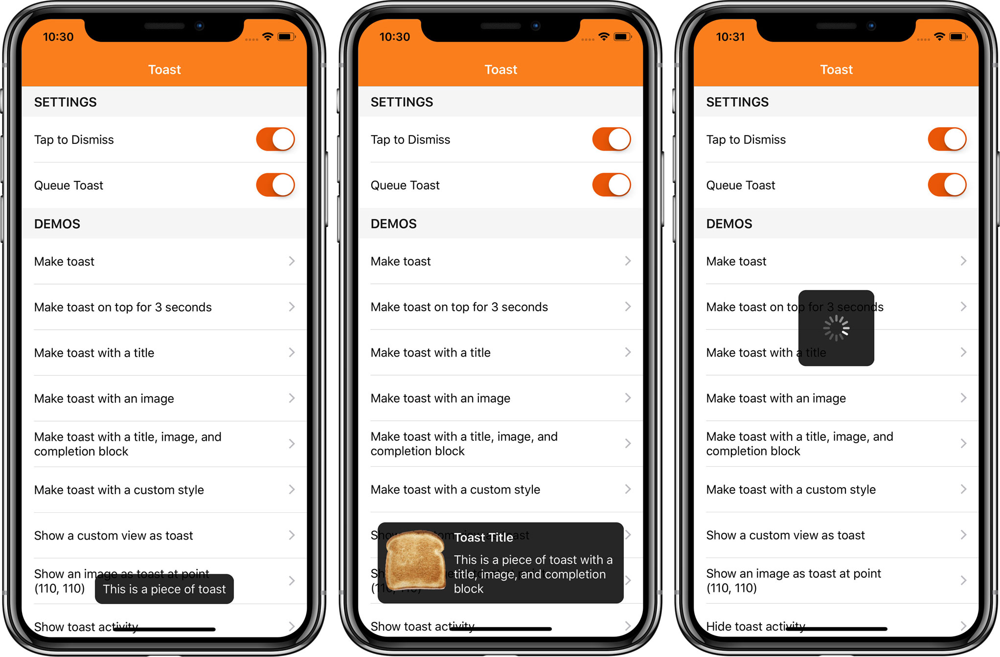

# Toast

 

## Description

🔸 An Objective-C category that adds toast notifications to the UIView object class.
 🔸 Refactored `Swift Package Manager` version of the [Toast for iOS](https://github.com/scalessec/Toast).

## Installation

Use `Swift Package Manager` to install.

## How To Use It

Read the original [README](https://github.com/scalessec/Toast/blob/71ce365dbaf57fce5d9eea2d91ad4318dae5ab96/README.md) file.

## Credits

Created and maintained by [scalessec](https://github.com/scalessec). Refactored and adapted for use with the `Swift Package Manager` by [epitonium](https://github.com/epitonium).

## License

`Toast` is distributed under the terms and conditions of the [LICENSE](https://github.com/scalessec/Toast/blob/71ce365dbaf57fce5d9eea2d91ad4318dae5ab96/license).
